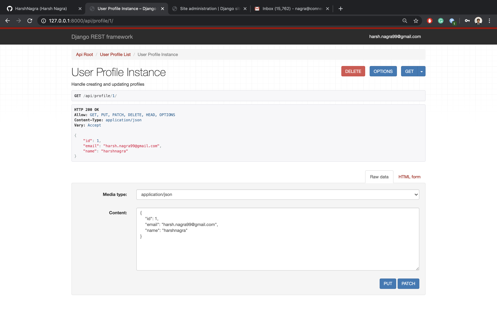

# Profiles Rest API using DJANGO

Introductory project to Django Framework to create a RESTful API.

#### Development Server
Vagrant and VirtualBox 

#### Application Code
1. Python
2. Django
3. Django Rest Framework

#### Tools
ModHeader - To modify HTTP headers.

## About

Specifications (Profile API)

1. Create new profile
    - Handle registration of new users.
    - Validate profile data.

2. Listing existing profiles
    - Search for profile.
    - Email and name.

3. View specific profiles
    - Profile ID.

4. Update profile of logged in user
    - Change name, email & password.

5. Delete Profile

6. Feed
    - List all feed items.
    - List particular feed item.

### `/api/profile/` :

###### GET: List all profiles
###### POST: Create new profile

### `/api/profile/<profile_id>` :

##### GET: View specific profile details.

#### Authenticate

###### POST: Update the full object.
###### PATCH: Update the object partially.
###### DELETE: Delete the object.

### `/api/login/` :

### `/api/feed/` :

##### GET: List all feed items.
##### POST: Create feed item for logged in user.

##### GET: Manage specific feed items.
##### PUT: Update the full feed item.
##### PATCH: Update the feed item partially.
##### DELETE: Delete feed item.

## Set Up 

#### Vagrant

`vagrant init ubuntu/bionic64` creating a server

`vagrant up` to create the development server.

`vagrant ssh` to run the development server.

`cd /vagrant` open vagrant folder.

`python -m venv ~/env` creating python Virtual Environment.

`source ~/env/bin/activate` to start the virtual environment

`deactivate` to deactivate the virtual environment

#### In the python virtual environment:

`cd /vagrant`

`pip install -r requirements.txt`

`django-admin.py startproject profiles_project .` To create a Django project.

`python manage.py startapp profiles_api` to create a Django App.

`python manage.py server 0.0.0.0:8000` To run the Django Development Web Server.

#### Reloading FIX

`python manage.py server 0.0.0.0:8000 --noreload` To run the Django Web Server.

#### Migrations FIX 

1. Delete SQLite file.
2. Open Migrations folder within the app.
3. Delete everything within the folder except `__init__.py`